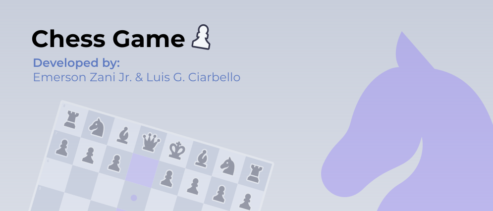

# ChessGame

>Jogo Xadrez desenvolvido em JavaFX

## 💻 **Pré-requisitos**
* Máquina que suporte uma IDE compátivel com JavaFX

## 🚀 Instalando ChessGame
* Realize o download da release "Final Version"

## 🎮 **Como jogar**
* Execute o programa
* Espere o carregamento e clique no botão de confirmar na tela de animação
* Insira o nome dos jogadores
* Jogue Xadrez!
* Durante o jogo o jogador pode desistir da partida ou propor empate ao seu adversário clicando em seus respectivos botões

## 🤝 **Colaboradores**
* Luis Gulherme Ciarbello
* RA 20037420
* Emerson Zani Junior
* RA: 20098240
